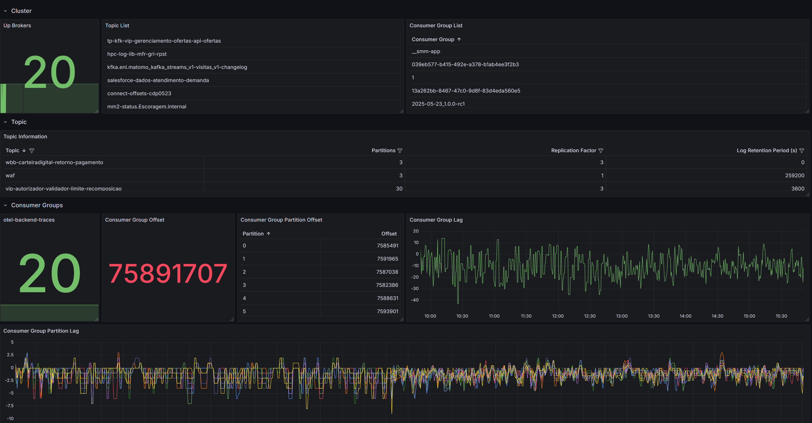

# kafkametrics-dashboard
Grafana Dashboard for Opentelemetry KafkaMetrics Receiver

Using the [Opentelemetry KafkaMetrics Receiver](https://github.com/open-telemetry/opentelemetry-collector-contrib/tree/main/receiver/kafkametricsreceiver), this dashboard creates a simple broker/consumer group/topic visualization

Also, exposes the consumer group lag (and partition lag) for further investigation

Be welcome to contribute
